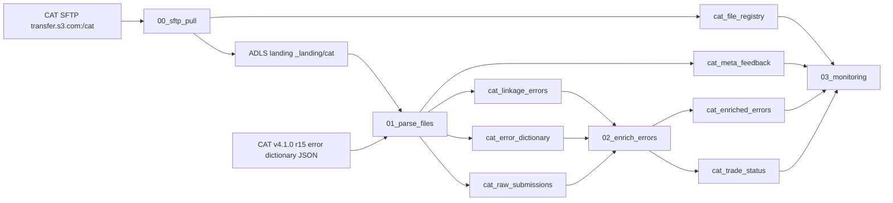

# CAT RegTechOps Pipeline - Architecture

## Components

| Component | Responsibility |
| --- | --- |
| `00_sftp_pull` | Connects to `transfer.s3.com:/cat` over SFTP using `TR-S3-CAT-SSHKey`, discovers supported CAT file types, registers immutable file versions, and lands new files under external ADLS storage. |
| `01_parse_files` | Loads the CAT v4.1.0 r15 error dictionary JSON once into Delta, parses landed meta files positionally, stores raw submissions, and stores raw error rows using only the first three error columns plus `raw_record`. |
| `02_enrich_errors` | Enriches error rows from the Delta dictionary and reconciles trade status as submission records minus error records. |
| `03_monitoring` | Publishes operational summaries for file lifecycle, feedback, trade status, unknown codes, and failed files. |

## Storage boundaries

All Delta tables are external and located under:

`abfss://analysis@stgdpdlwe.dfs.core.windows.net/BI_OUTPUT/RegTechOps/`

Each table has a dedicated subfolder named exactly as the table. No managed tables are created.

## Mermaid diagram

The editable diagram is maintained at `../diagrams/architecture.mmd`.

## Phase 2 preparation

Phase 1 stores `event_type` and complete `raw_record` values without enforcing CAT event schemas. This preserves all source data for Phase 2 event-type-aware parsing and a schema registry per event type.
