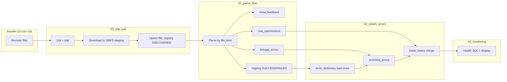

# Architecture

## Text description

The pipeline is a **linear Databricks job** with four notebooks. **SFTP pull** is the only component that opens the network boundary to `transfer.s3.com`. It writes immutable download facts to DBFS (configurable `staging_dbfs_dir`) and registers each remote object exactly once in `bi_output_regtechops_cat_file_registry` keyed by `sftp_remote_path`. **Parse** reads only rows in `DISCOVERED` state with a populated `local_staging_path`, transitions them through `PROCESSING`, and merges parsed payloads into domain tables using deterministic surrogate keys (`sha256` over natural parts) so re-runs do not duplicate rows. **Enrich** guarantees the Appendix E JSON is present in `bi_output_regtechops_cat_error_dictionary` (empty-table bootstrap only), merges new error rows into `bi_output_regtechops_cat_enriched_errors` with a left join to the dictionary, and rebuilds `bi_output_regtechops_cat_trade_status` via a Delta `MERGE` keyed on `raw_submission_id`. **Monitoring** is read-only SQL for operators.

## Idempotency guarantees

| Layer | Mechanism |
|-------|-----------|
| Registry | One row per `sftp_remote_path`; `SUCCESS` rows are skipped by SFTP pull; `FAILED` rows may be retried manually after fix |
| Submissions / meta / errors | Delta `MERGE` on stable row ids (`raw_submission_id`, `meta_feedback_id`, `error_row_id`) |
| Enriched errors | `MERGE` on `error_row_id` |
| Trade status | `MERGE` on `raw_submission_id` — late errors flip a row from `ACCEPTED` to `REJECTED` on the next run |

## Mermaid diagram

The diagram source lives in `diagrams/architecture.mmd` and can be pasted into Confluence Mermaid macros or rendered in Git.

## Phase 2 (design only)

Prepare for **event-type-aware parsing**: maintain a versioned schema registry keyed by CAT `event_type` (second CSV field in Phase 1 extraction). Parsing notebooks would branch on `event_type`, validate required columns per registry entry, and write typed Bronze/Silver tables while retaining `raw_record` for audit. **No Phase 2 code** is included in this repository revision.
