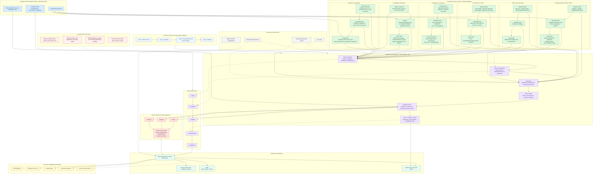

# RegTech Recon Engine Diagram (Project-Aligned, Final Inventory)

```mermaid
flowchart TD
  subgraph KPI["Regulatory Reconciliation Engine - Operating Profile"]
    direction LR
    K1["10-20 External SFTPs"]
    K2["Daily automated runs via Databricks Jobs"]
    K3["3 quality checks: Completeness / Correctness / Timeliness"]
  end

  subgraph ARCH["Technical Architecture (Presentation-Aligned)"]
    direction LR
    A1["Layer 1: Data Sources"]
    A2["Layer 2: Ingestion"]
    A3["Layer 3: Normalisation and Recon Engine"]
    A4["Layer 4: Outputs"]
    A1 --> A2 --> A3 --> A4
  end

  subgraph MODELS["Final Data Source Inventory - Reporting Models"]
    direction TB
    subgraph TR["TR-Based (MiFID / EMIR / ASIC)"]
      TR_EXP["Expected state\nSynapse + Hedge + RegReportDB reports"]
      TR_SUB["Submitted state\nCappitech submission files\nbronze_cappitech_* planned"]
      TR_ACT["Actual state\nRegis/TRAX/DTCC responses\nRegis ingested, DTCC/TRAX pending"]
      TR_EXP --> TR_SUB --> TR_ACT
    end

    subgraph CAT["CAT (US) Event-Driven"]
      CAT_EXP["Expected state\nReg_US_* datasets (SQL + main.regtech gold mirrors)"]
      CAT_SUB["Submitted state\nS3 vendor exchange"]
      CAT_ACT["Actual state\nFINRA CAT feedback files via SharePoint"]
      CAT_EXP --> CAT_SUB --> CAT_ACT
    end

    subgraph SFTR["SFTR Direct to DTCC"]
      SFTR_EXP["Expected state\nVision EOD -> lifecycle derivation\nmain.regtech_stg.bronze_sftr_report"]
      SFTR_SUB["Submitted state\nDaily SFTR XML direct to DTCC (no vendor)"]
      SFTR_ACT["Actual state\nDTCC acknowledgements/rejections via SFTP"]
      SFTR_EXP --> SFTR_SUB --> SFTR_ACT
    end

    subgraph LTR["LTR Manual / Transitional"]
      LTR_EXP["Expected state\nmain.dealing futures holdings + customer ownership"]
      LTR_SUB["Submitted state\nFIPS VM transfer to CME/CFTC\nLTR + 102A payloads"]
      LTR_ACT["Limited actual state\nacknowledgements + transfer logs\nbronze_ltr_* tracking tables"]
      LTR_EXP --> LTR_SUB --> LTR_ACT
    end

    subgraph LP["LP Delegated Reporting"]
      LP_EXP["Stage 1 expected\nInternal DUCO execution vs LP source data"]
      LP_SUB["Stage 2 submitted/regulatory path\nLP reports to REGIS / UNAVISTA / DTCC"]
      LP_ACT["Actual state\nREGIS full coverage, UNAVISTA/DTCC partial\ningestion pending for non-REGIS"]
      LP_EXP --> LP_SUB --> LP_ACT
    end

    subgraph APA["APA Real-Time (MiFID)"]
      APA_EXP["Expected events\nTrading Event Hub -> internal services -> APA Event Hub"]
      APA_SUB["Submitted state\nTradeEcho publication stream (Event Hub path)"]
      APA_ACT["Actual state\nTradeEcho SFTP responses\nmain.regtech.bronze_tradeecho_responses"]
      APA_EXP --> APA_SUB --> APA_ACT
    end
  end

  subgraph DBX["Databricks Normalisation + Reconciliation Layer"]
    direction LR
    BR["Bronze ingestion\nSFTP / EventHub / SharePoint / transfer logs"]
    SI["Silver harmonisation\nReport-specific standardisation and enrichment"]
    GO["Gold views\nExpected vs Submitted vs Actual by report type"]
    RECON["Recon engine\ntrade, event, lifecycle, position matching"]
    VALID["Validation packs\nfield-level, sequencing, threshold, transfer checks"]
    AUD["Audit + semantic context\ntimestamp, user attribution, remediation trace"]
    BR --> SI --> GO --> RECON --> VALID --> AUD
  end

  subgraph FLOW["Daily Solution Flow"]
    direction LR
    F1["Ingest"] --> F2["Normalise"] --> F3["Validate"] --> F4["Log and Report"] --> F5["Dashboard"]
  end

  subgraph REM["Failure Detection and Remediation UI"]
    direction LR
    C["Critical"]
    W["Warning"]
    A["Advisory"]
    PANEL["Failure context panel\nstep-by-step fix guide\nseverity filters\nresolution audit log"]
    C --> PANEL
    W --> PANEL
    A --> PANEL
  end

  subgraph OUT["Outputs and Monitoring"]
    direction LR
    DASH["React dashboard on Azure App Service"]
    PBI["Power BI views and compliance exports"]
    ALERT["Alerts\nEmail / Slack / Teams"]
    DELTA["Delta results and audit tables"]
    DASH --> ALERT
    DASH --> PBI
    DASH --> DELTA
  end

  subgraph SEC["Security and Governance"]
    direction LR
    UC["Unity Catalog access control"]
    KV["Key Vault"]
    RBAC["RBAC and user management"]
    NET["Private network controls"]
  end

  subgraph ROAD["Next-Gen Capabilities (Roadmap)"]
    direction LR
    R1["Self-reporting"]
    R2["Manual fix from UI"]
    R3["Custom alerts"]
    R4["NCA auto-reporting"]
    R5["Custom checks from UI"]
  end

  subgraph RISK["Inventory Risks and Gaps"]
    direction TB
    G1["Manual Google Sheets remain a governance risk"]
    G2["Split SQL Server and Databricks ownership model"]
    G3["Partial ingestion coverage: DTCC/TRAX/UNAVISTA pending"]
    G4["LTR has limited actual-state response model"]
  end

  K1 --> TR_SUB
  K1 --> SFTR_SUB
  K1 --> LP_SUB
  K1 --> APA_ACT
  K2 --> FLOW
  K3 --> VALID
  ARCH --> DBX

  TR_EXP --> GO
  TR_SUB --> BR
  TR_ACT --> BR
  CAT_EXP --> GO
  CAT_SUB --> BR
  CAT_ACT --> BR
  SFTR_EXP --> GO
  SFTR_SUB --> BR
  SFTR_ACT --> BR
  LTR_EXP --> GO
  LTR_SUB --> BR
  LTR_ACT --> BR
  LP_EXP --> GO
  LP_SUB --> BR
  LP_ACT --> BR
  APA_EXP --> BR
  APA_SUB --> BR
  APA_ACT --> BR

  BR -.-> F1
  SI -.-> F2
  VALID -.-> F3
  AUD -.-> F4
  F5 --> DASH
  VALID --> C
  VALID --> W
  VALID --> A
  PANEL --> DASH
  AUD --> DELTA

  UC -.-> SI
  UC -.-> GO
  KV -.-> BR
  RBAC -.-> DASH
  NET -.-> BR
  NET -.-> DASH

  DASH -.-> R1
  DASH -.-> R2
  DASH -.-> R3
  DASH -.-> R4
  DASH -.-> R5
  RISK -.-> DBX

  classDef kpi fill:#d8ecff,stroke:#2f6fab,stroke-width:1px,color:#0e2a47;
  classDef layer fill:#f0f7ff,stroke:#3f6ca8,stroke-width:1px,color:#123457;
  classDef model fill:#def7df,stroke:#2f8f4f,stroke-width:1px,color:#12391f;
  classDef core fill:#efe5ff,stroke:#6f42c1,stroke-width:1px,color:#2f1a5f;
  classDef output fill:#e8f9f3,stroke:#1d8a66,stroke-width:1px,color:#0f3c2e;
  classDef fail fill:#ffe2e2,stroke:#b83b3b,stroke-width:1px,color:#4a1212;
  classDef controls fill:#f4f4f4,stroke:#666,stroke-width:1px,color:#222;
  classDef roadmap fill:#fff7d6,stroke:#9b8700,stroke-width:1px,color:#3d3400;
  classDef risks fill:#fff0f0,stroke:#a33,stroke-width:1px,color:#4a1212;

  class K1,K2,K3 kpi;
  class A1,A2,A3,A4 layer;
  class TR_EXP,TR_SUB,TR_ACT,CAT_EXP,CAT_SUB,CAT_ACT,SFTR_EXP,SFTR_SUB,SFTR_ACT,LTR_EXP,LTR_SUB,LTR_ACT,LP_EXP,LP_SUB,LP_ACT,APA_EXP,APA_SUB,APA_ACT model;
  class BR,SI,GO,RECON,VALID,AUD,F1,F2,F3,F4,F5 core;
  class DASH,PBI,ALERT,DELTA output;
  class C,W,A,PANEL fail;
  class UC,KV,RBAC,NET controls;
  class R1,R2,R3,R4,R5 roadmap;
  class G1,G2,G3,G4 risks;
```

