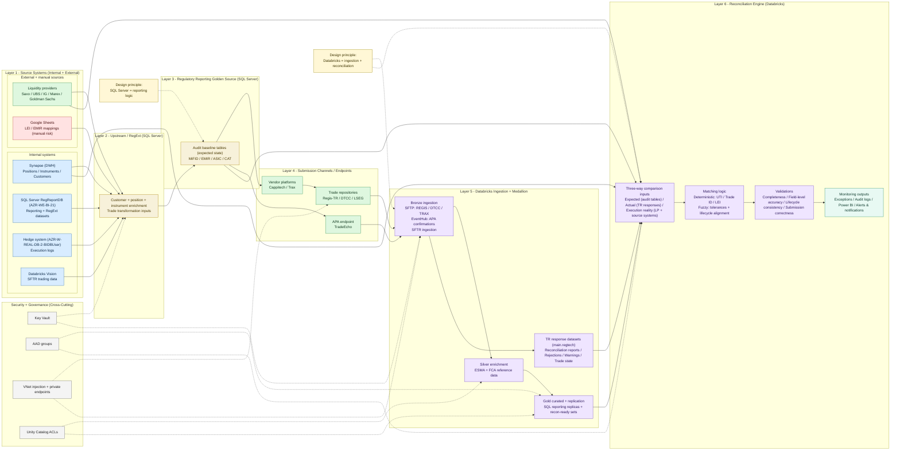

# RegTech Architecture Diagram

```mermaid
flowchart LR
  %% Layer 1 - sources
  subgraph L1["Layer 1 - Source Systems (Internal + External)"]
    direction TB
    subgraph INT["Internal systems"]
      SYN["Synapse (DWH)\nPositions / Instruments / Customers"]
      SQLSRC["SQL Server RegReportDB (AZR-WE-BI-21)\nReporting + RegExt datasets"]
      HEDGE["Hedge system (AZR-W-REAL-DB-2-BIDBUser)\nExecution logs"]
      VISION["Databricks Vision\nSFTR trading data"]
    end
    subgraph EXT["External + manual sources"]
      LP["Liquidity providers\nSaxo / UBS / IG / Marex / Goldman Sachs"]
      GS["Google Sheets\nLEI / EMIR mappings (manual risk)"]
    end
  end

  %% Layer 2
  subgraph L2["Layer 2 - Upstream / RegExt (SQL Server)"]
    UP["Customer + position + instrument enrichment\nTrade transformation inputs"]
  end

  %% Layer 3
  subgraph L3["Layer 3 - Regulatory Reporting Golden Source (SQL Server)"]
    GOLDEN["Audit baseline tables (expected state)\nMiFID / EMIR / ASIC / CAT"]
  end

  %% Layer 4
  subgraph L4["Layer 4 - Submission Channels / Endpoints"]
    direction TB
    VEN["Vendor platforms\nCappitech / Trax"]
    TRSUB["Trade repositories\nRegis-TR / DTCC / LSEG"]
    APASUB["APA endpoint\nTradeEcho"]
  end

  %% Layer 5
  subgraph L5["Layer 5 - Databricks Ingestion + Medallion"]
    direction TB
    BR["Bronze ingestion\nSFTP: REGIS / DTCC / TRAX\nEventHub: APA confirmations\nSFTR ingestion"]
    SI["Silver enrichment\nESMA + FCA reference data"]
    GO["Gold curated + replication\nSQL reporting replicas + recon-ready sets"]
    TRR["TR response datasets (main.regtech)\nReconciliation reports / Rejections / Warnings / Trade state"]
  end

  %% Layer 6
  subgraph L6["Layer 6 - Reconciliation Engine (Databricks)"]
    direction TB
    INP["Three-way comparison inputs\nExpected (audit tables) / Actual (TR responses) / Execution reality (LP + source systems)"]
    MATCH["Matching logic\nDeterministic: UTI / Trade ID / LEI\nFuzzy: tolerances + lifecycle alignment"]
    VALID["Validations\nCompleteness / Field-level accuracy / Lifecycle consistency / Submission correctness"]
    OUT["Monitoring outputs\nExceptions / Audit logs / Power BI / Alerts & notifications"]
  end

  %% Cross-cutting controls
  subgraph SG["Security + Governance (Cross-Cutting)"]
    direction LR
    KV["Key Vault"]
    AAD["AAD groups"]
    VNET["VNet injection + private endpoints"]
    UC["Unity Catalog ACLs"]
  end

  %% Primary lineage
  SYN --> UP
  SQLSRC --> UP
  HEDGE --> UP
  VISION --> UP
  LP --> UP
  GS --> UP
  UP --> GOLDEN
  GOLDEN --> VEN
  VEN --> TRSUB
  GOLDEN --> APASUB
  TRSUB --> BR
  APASUB --> BR
  BR --> SI --> GO
  BR --> TRR
  GO --> INP
  GOLDEN --> INP
  TRR --> INP
  LP --> INP
  SYN --> INP
  INP --> MATCH --> VALID --> OUT

  %% Principles
  P1["Design principle:\nSQL Server = reporting logic"]
  P2["Design principle:\nDatabricks = ingestion + reconciliation"]
  P1 -.-> GOLDEN
  P2 -.-> BR
  P2 -.-> INP

  %% Controls mapped to layers
  KV -.-> UP
  KV -.-> BR
  AAD -.-> GO
  AAD -.-> INP
  VNET -.-> TRSUB
  VNET -.-> BR
  UC -.-> SI
  UC -.-> GO

  %% Visual styling
  classDef internal fill:#d8ecff,stroke:#2f6fab,stroke-width:1px,color:#0e2a47;
  classDef external fill:#def7df,stroke:#2f8f4f,stroke-width:1px,color:#12391f;
  classDef risk fill:#ffe2e2,stroke:#b83b3b,stroke-width:1px,color:#4a1212;
  classDef sql fill:#f7f1da,stroke:#a67c00,stroke-width:1px,color:#4a3900;
  classDef dbx fill:#efe5ff,stroke:#6f42c1,stroke-width:1px,color:#2f1a5f;
  classDef outputs fill:#e8f9f3,stroke:#1d8a66,stroke-width:1px,color:#0f3c2e;
  classDef controls fill:#f4f4f4,stroke:#666,stroke-width:1px,color:#222;
  classDef principle fill:#fff7d6,stroke:#9b8700,stroke-width:1px,color:#3d3400;

  class SYN,SQLSRC,HEDGE,VISION internal;
  class LP,VEN,TRSUB,APASUB external;
  class GS risk;
  class UP,GOLDEN sql;
  class BR,TRR,SI,GO,INP,MATCH,VALID dbx;
  class OUT outputs;
  class KV,AAD,VNET,UC controls;
  class P1,P2 principle;
```

