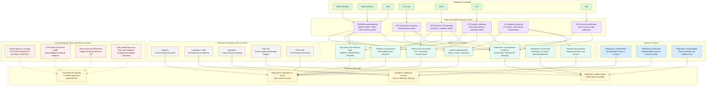

# RegTech Recon Engine Diagram (Business Architecture)

```mermaid
flowchart TD
  subgraph PURPOSE["Business Purpose"]
    direction LR
    P1["Regulatory completeness\nAll reportable activity is covered"]
    P2["Regulatory correctness\nReported data matches business reality"]
    P3["Regulatory accountability\nClear ownership and evidence trail"]
  end

  subgraph REG["Regulation Coverage"]
    direction LR
    R1["MiFID (EU/UK)"]
    R2["EMIR (EU/UK)"]
    R3["ASIC"]
    R4["CAT (US)"]
    R5["SFTR"]
    R6["LTR"]
    R7["APA"]
  end

  subgraph MODELS["Reporting Models (Business View)"]
    direction TB
    M1["TR/ARM-based reporting\n(MiFID / EMIR / ASIC)\neToro reporting entity"]
    M2["CAT event-driven reporting\nOrder lifecycle model"]
    M3["SFTR direct-to-TR reporting\nLifecycle + collateral model"]
    M4["LTR position reporting\nManual/transitional operating model"]
    M5["LP delegated reporting\nLP submits, eToro retains responsibility"]
    M6["APA real-time publication\nNear real-time trade publication"]
  end

  subgraph SOURCES["Data Source Domains"]
    direction LR
    S1["Internal trading activity\nTrades, orders, executions"]
    S2["Positions and exposure\nEOD holdings and valuations"]
    S3["Client and account data\nKYC, ownership, classifications"]
    S4["Instrument and reference data\nISIN/UPI, FIRDS/FITRS, metadata"]
    S5["External counterparties\nLiquidity providers and venues"]
    S6["Submission and response evidence\nVendor files, TR/APA/CAT feedback"]
    S7["Operational control data\nAudit logs, run status, acknowledgements"]
  end

  subgraph STAKE["Business Ownership and Consumers"]
    direction LR
    O1["RegTech\nControl framework owner"]
    O2["Compliance / Risk\nOversight and remediation"]
    O3["Operations\nDaily exception handling"]
    O4["Data / BI\nSource quality and lineage support"]
    O5["eToro USA\nCAT feedback ownership"]
  end

  subgraph OUT["Business Outcomes"]
    direction LR
    B1["Expected vs Submitted vs Actual\nclear control narrative"]
    B2["Exception visibility by severity\nCritical / Warning / Advisory"]
    B3["Regulatory evidence pack\nAudit-ready traceability"]
    B4["Prioritised risk backlog\nCoverage gaps and operating risks"]
  end

  subgraph GAPS["Current Business Risks (from final inventory)"]
    direction TB
    G1["Partial ingestion coverage\nDTCC/TRAX/UNAVISTA pending in some flows"]
    G2["LTR limited actual-state model\nacknowledgement-based validation"]
    G3["Manual sources still present\nGoogle Sheets governance risk"]
    G4["Split ownership across SQL and Databricks\nlineage/accountability complexity"]
  end

  P1 --> B1
  P2 --> B2
  P3 --> B3

  R1 --> M1
  R2 --> M1
  R3 --> M1
  R4 --> M2
  R5 --> M3
  R6 --> M4
  R7 --> M6

  M1 --> S1
  M1 --> S2
  M1 --> S3
  M1 --> S4
  M1 --> S6

  M2 --> S1
  M2 --> S3
  M2 --> S6

  M3 --> S2
  M3 --> S4
  M3 --> S6

  M4 --> S2
  M4 --> S3
  M4 --> S7

  M5 --> S1
  M5 --> S5
  M5 --> S6

  M6 --> S1
  M6 --> S6

  S1 --> B1
  S2 --> B1
  S3 --> B1
  S4 --> B1
  S5 --> B2
  S6 --> B3
  S7 --> B3

  O1 --> B1
  O2 --> B2
  O3 --> B2
  O4 --> B3
  O5 --> B1

  G1 -.-> B4
  G2 -.-> B4
  G3 -.-> B4
  G4 -.-> B4

  classDef purpose fill:#d8ecff,stroke:#2f6fab,stroke-width:1px,color:#0e2a47;
  classDef reg fill:#def7df,stroke:#2f8f4f,stroke-width:1px,color:#12391f;
  classDef model fill:#efe5ff,stroke:#6f42c1,stroke-width:1px,color:#2f1a5f;
  classDef source fill:#e8f9f3,stroke:#1d8a66,stroke-width:1px,color:#0f3c2e;
  classDef owner fill:#f4f4f4,stroke:#666,stroke-width:1px,color:#222;
  classDef outcome fill:#fff7d6,stroke:#9b8700,stroke-width:1px,color:#3d3400;
  classDef risk fill:#fff0f0,stroke:#a33,stroke-width:1px,color:#4a1212;

  class P1,P2,P3 purpose;
  class R1,R2,R3,R4,R5,R6,R7 reg;
  class M1,M2,M3,M4,M5,M6 model;
  class S1,S2,S3,S4,S5,S6,S7 source;
  class O1,O2,O3,O4,O5 owner;
  class B1,B2,B3,B4 outcome;
  class G1,G2,G3,G4 risk;
```
