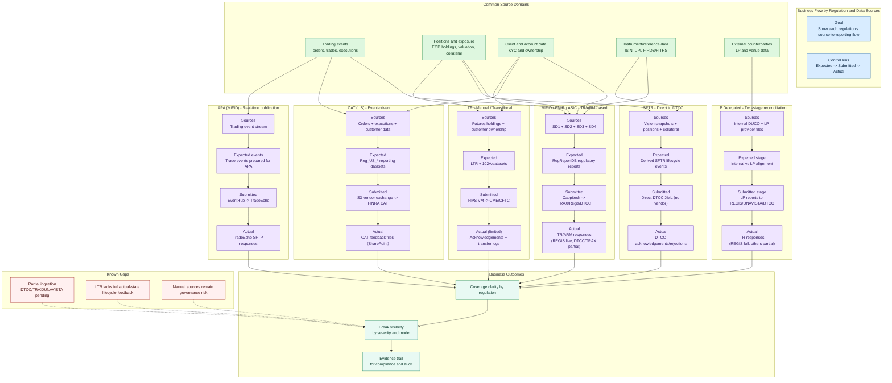

# RegTech Recon Engine Diagram (Business Flow by Regulation)

```mermaid
flowchart TD
  subgraph HEADER["Business Flow by Regulation and Data Sources"]
    direction LR
    H1["Goal\nShow each regulation's source-to-reporting flow"]
    H2["Control lens\nExpected -> Submitted -> Actual"]
  end

  subgraph SOURCEDOMAINS["Common Source Domains"]
    direction LR
    SD1["Trading events\norders, trades, executions"]
    SD2["Positions and exposure\nEOD holdings, valuation, collateral"]
    SD3["Client and account data\nKYC and ownership"]
    SD4["Instrument/reference data\nISIN, UPI, FIRDS/FITRS"]
    SD5["External counterparties\nLP and venue data"]
  end

  subgraph FLOW1["MiFID / EMIR / ASIC - TR/ARM-based"]
    direction LR
    F1S["Sources\nSD1 + SD2 + SD3 + SD4"] --> F1E["Expected\nRegReportDB regulatory reports"] --> F1U["Submitted\nCappitech -> TRAX/Regis/DTCC"] --> F1A["Actual\nTR/ARM responses\n(REGIS live, DTCC/TRAX partial)"]
  end

  subgraph FLOW2["CAT (US) - Event-driven"]
    direction LR
    F2S["Sources\nOrders + executions + customer data"] --> F2E["Expected\nReg_US_* reporting datasets"] --> F2U["Submitted\nS3 vendor exchange -> FINRA CAT"] --> F2A["Actual\nCAT feedback files (SharePoint)"]
  end

  subgraph FLOW3["SFTR - Direct to DTCC"]
    direction LR
    F3S["Sources\nVision snapshots + positions + collateral"] --> F3E["Expected\nDerived SFTR lifecycle events"] --> F3U["Submitted\nDirect DTCC XML (no vendor)"] --> F3A["Actual\nDTCC acknowledgements/rejections"]
  end

  subgraph FLOW4["LTR - Manual / Transitional"]
    direction LR
    F4S["Sources\nFutures holdings + customer ownership"] --> F4E["Expected\nLTR + 102A datasets"] --> F4U["Submitted\nFIPS VM -> CME/CFTC"] --> F4A["Actual (limited)\nAcknowledgements + transfer logs"]
  end

  subgraph FLOW5["LP Delegated - Two-stage reconciliation"]
    direction LR
    F5S["Sources\nInternal DUCO + LP provider files"] --> F5E["Expected stage\nInternal vs LP alignment"] --> F5U["Submitted stage\nLP reports to REGIS/UNAVISTA/DTCC"] --> F5A["Actual\nTR responses\n(REGIS full, others partial)"]
  end

  subgraph FLOW6["APA (MiFID) - Real-time publication"]
    direction LR
    F6S["Sources\nTrading event stream"] --> F6E["Expected events\nTrade events prepared for APA"] --> F6U["Submitted\nEventHub -> TradeEcho"] --> F6A["Actual\nTradeEcho SFTP responses"]
  end

  subgraph OUT["Business Outcomes"]
    direction LR
    O1["Coverage clarity by regulation"]
    O2["Break visibility\nby severity and model"]
    O3["Evidence trail\nfor compliance and audit"]
  end

  subgraph GAPS["Known Gaps"]
    direction LR
    G1["Partial ingestion\nDTCC/TRAX/UNAVISTA pending"]
    G2["LTR lacks full actual-state lifecycle feedback"]
    G3["Manual sources remain governance risk"]
  end

  SD1 --> F1S
  SD1 --> F2S
  SD1 --> F6S
  SD2 --> F1S
  SD2 --> F3S
  SD2 --> F4S
  SD3 --> F1S
  SD3 --> F2S
  SD3 --> F4S
  SD4 --> F1S
  SD4 --> F3S
  SD5 --> F5S

  F1A --> O1
  F2A --> O1
  F3A --> O1
  F4A --> O1
  F5A --> O1
  F6A --> O1
  O1 --> O2 --> O3

  G1 -.-> O2
  G2 -.-> O2
  G3 -.-> O2

  classDef head fill:#d8ecff,stroke:#2f6fab,stroke-width:1px,color:#0e2a47;
  classDef source fill:#def7df,stroke:#2f8f4f,stroke-width:1px,color:#12391f;
  classDef flow fill:#efe5ff,stroke:#6f42c1,stroke-width:1px,color:#2f1a5f;
  classDef out fill:#e8f9f3,stroke:#1d8a66,stroke-width:1px,color:#0f3c2e;
  classDef gap fill:#fff0f0,stroke:#a33,stroke-width:1px,color:#4a1212;

  class H1,H2 head;
  class SD1,SD2,SD3,SD4,SD5 source;
  class F1S,F1E,F1U,F1A,F2S,F2E,F2U,F2A,F3S,F3E,F3U,F3A,F4S,F4E,F4U,F4A,F5S,F5E,F5U,F5A,F6S,F6E,F6U,F6A flow;
  class O1,O2,O3 out;
  class G1,G2,G3 gap;
```
