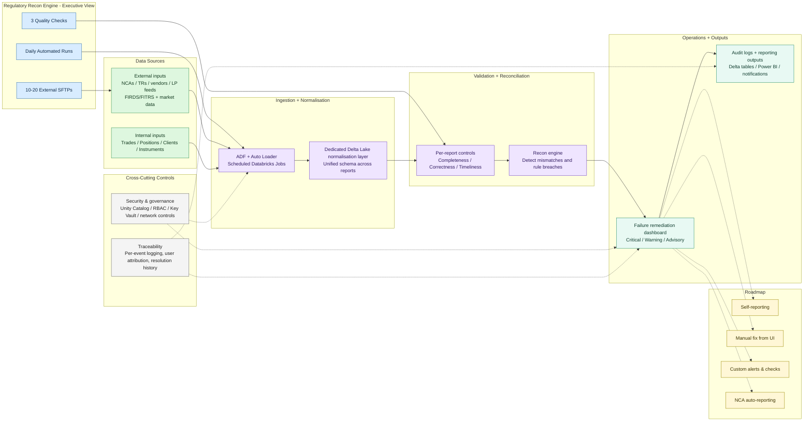

# RegTech Recon Engine Diagram (Executive Summary)

```mermaid
flowchart LR
  %% Executive summary view
  subgraph KPI["Regulatory Recon Engine - Executive View"]
    direction LR
    K1["10-20 External SFTPs"]
    K2["Daily Automated Runs"]
    K3["3 Quality Checks"]
  end

  subgraph SRC["Data Sources"]
    direction TB
    EXT["External inputs\nNCAs / TRs / vendors / LP feeds\nFIRDS/FITRS + market data"]
    INT["Internal inputs\nTrades / Positions / Clients / Instruments"]
  end

  subgraph ING["Ingestion + Normalisation"]
    direction TB
    PIPE["ADF + Auto Loader\nScheduled Databricks Jobs"]
    NORM["Dedicated Delta Lake normalisation layer\nUnified schema across reports"]
  end

  subgraph VAL["Validation + Reconciliation"]
    direction TB
    CHECKS["Per-report controls\nCompleteness / Correctness / Timeliness"]
    RECON["Recon engine\nDetect mismatches and rule breaches"]
  end

  subgraph OPS["Operations + Outputs"]
    direction TB
    UI["Failure remediation dashboard\nCritical / Warning / Advisory"]
    OUT["Audit logs + reporting outputs\nDelta tables / Power BI / notifications"]
  end

  subgraph CTRL["Cross-Cutting Controls"]
    direction LR
    SEC["Security & governance\nUnity Catalog / RBAC / Key Vault / network controls"]
    TRACE["Traceability\nPer-event logging, user attribution, resolution history"]
  end

  subgraph ROAD["Roadmap"]
    direction LR
    R1["Self-reporting"]
    R2["Manual fix from UI"]
    R3["Custom alerts & checks"]
    R4["NCA auto-reporting"]
  end

  K1 --> EXT
  K2 --> PIPE
  K3 --> CHECKS

  EXT --> PIPE
  INT --> PIPE
  PIPE --> NORM --> CHECKS --> RECON --> UI --> OUT

  SEC -.-> PIPE
  SEC -.-> UI
  TRACE -.-> UI
  TRACE -.-> OUT

  UI -.-> R1
  UI -.-> R2
  UI -.-> R3
  UI -.-> R4

  classDef kpi fill:#d8ecff,stroke:#2f6fab,stroke-width:1px,color:#0e2a47;
  classDef src fill:#def7df,stroke:#2f8f4f,stroke-width:1px,color:#12391f;
  classDef core fill:#efe5ff,stroke:#6f42c1,stroke-width:1px,color:#2f1a5f;
  classDef ops fill:#e8f9f3,stroke:#1d8a66,stroke-width:1px,color:#0f3c2e;
  classDef ctrl fill:#f4f4f4,stroke:#666,stroke-width:1px,color:#222;
  classDef road fill:#fff7d6,stroke:#9b8700,stroke-width:1px,color:#3d3400;

  class K1,K2,K3 kpi;
  class EXT,INT src;
  class PIPE,NORM,CHECKS,RECON core;
  class UI,OUT ops;
  class SEC,TRACE ctrl;
  class R1,R2,R3,R4 road;
```
