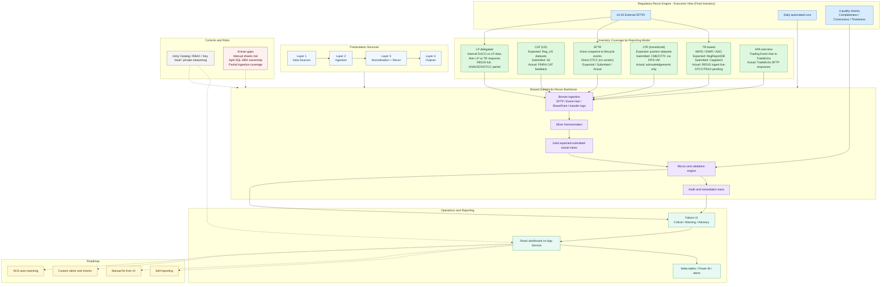

# RegTech Recon Engine Diagram (Executive Summary, Final Inventory)

```mermaid
flowchart TD
  subgraph KPI["Regulatory Recon Engine - Executive View (Final Inventory)"]
    direction LR
    K1["10-20 External SFTPs"]
    K2["Daily automated runs"]
    K3["3 quality checks\nCompleteness / Correctness / Timeliness"]
  end

  subgraph LAYER["Presentation Structure"]
    direction LR
    L1["Layer 1\nData Sources"]
    L2["Layer 2\nIngestion"]
    L3["Layer 3\nNormalisation + Recon"]
    L4["Layer 4\nOutputs"]
    L1 --> L2 --> L3 --> L4
  end

  subgraph MODELS["Inventory Coverage by Reporting Model"]
    direction LR
    M1["TR-based\nMiFID / EMIR / ASIC\nExpected: RegReportDB\nSubmitted: Cappitech\nActual: REGIS ingest live,\nDTCC/TRAX pending"]
    M2["CAT (US)\nExpected: Reg_US datasets\nSubmitted: S3\nActual: FINRA CAT feedback"]
    M3["SFTR\nVision snapshot to lifecycle events\nDirect DTCC (no vendor)\nExpected / Submitted / Actual"]
    M4["LTR (transitional)\nExpected: position datasets\nSubmitted: CME/CFTC via FIPS VM\nActual: acknowledgements only"]
    M5["LP delegated\nInternal DUCO vs LP data,\nthen LP vs TR response\nREGIS full, UNAVISTA/DTCC partial"]
    M6["APA real-time\nTrading Event Hub to TradeEcho\nActual: TradeEcho SFTP responses"]
  end

  subgraph CORE["Shared Databricks Recon Backbone"]
    direction LR
    BR["Bronze ingestion\nSFTP / Event Hub / SharePoint / transfer logs"]
    SI["Silver harmonisation"]
    GO["Gold expected-submitted-actual views"]
    RE["Recon and validation engine"]
    AU["Audit and remediation trace"]
    BR --> SI --> GO --> RE --> AU
  end

  subgraph OUT["Operations and Reporting"]
    direction LR
    UI["Failure UI\nCritical / Warning / Advisory"]
    DASH["React dashboard on App Service"]
    REP["Delta tables / Power BI / alerts"]
    UI --> DASH --> REP
  end

  subgraph CTRL["Controls and Risks"]
    direction LR
    SEC["Unity Catalog / RBAC / Key Vault / private networking"]
    RISK["Known gaps\nManual sheets risk\nSplit SQL-DBX ownership\nPartial ingestion coverage"]
  end

  subgraph ROAD["Roadmap"]
    direction LR
    R1["Self-reporting"]
    R2["Manual fix from UI"]
    R3["Custom alerts and checks"]
    R4["NCA auto-reporting"]
  end

  K1 --> M1
  K1 --> M3
  K1 --> M5
  K2 --> CORE
  K3 --> RE

  M1 --> BR
  M2 --> BR
  M3 --> BR
  M4 --> BR
  M5 --> BR
  M6 --> BR

  LAYER --> CORE
  RE --> UI
  AU --> UI

  SEC -.-> CORE
  SEC -.-> DASH
  RISK -.-> CORE

  DASH -.-> R1
  DASH -.-> R2
  DASH -.-> R3
  DASH -.-> R4

  classDef kpi fill:#d8ecff,stroke:#2f6fab,stroke-width:1px,color:#0e2a47;
  classDef layer fill:#f0f7ff,stroke:#3f6ca8,stroke-width:1px,color:#123457;
  classDef model fill:#def7df,stroke:#2f8f4f,stroke-width:1px,color:#12391f;
  classDef core fill:#efe5ff,stroke:#6f42c1,stroke-width:1px,color:#2f1a5f;
  classDef out fill:#e8f9f3,stroke:#1d8a66,stroke-width:1px,color:#0f3c2e;
  classDef ctrl fill:#f4f4f4,stroke:#666,stroke-width:1px,color:#222;
  classDef road fill:#fff7d6,stroke:#9b8700,stroke-width:1px,color:#3d3400;
  classDef risks fill:#fff0f0,stroke:#a33,stroke-width:1px,color:#4a1212;

  class K1,K2,K3 kpi;
  class L1,L2,L3,L4 layer;
  class M1,M2,M3,M4,M5,M6 model;
  class BR,SI,GO,RE,AU core;
  class UI,DASH,REP out;
  class SEC ctrl;
  class RISK risks;
  class R1,R2,R3,R4 road;
```
