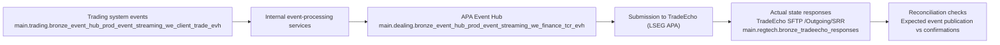

# Reporting Model: APA (MiFID) Data Sources

```mermaid
flowchart LR
  TS["Trading system events\nmain.trading.bronze_event_hub_prod_event_streaming_we_client_trade_evh"] --> PROC["Internal event-processing services"]
  PROC --> APAHUB["APA Event Hub\nmain.dealing.bronze_event_hub_prod_event_streaming_we_finance_tcr_evh"]
  APAHUB --> SUB["Submission to TradeEcho (LSEG APA)"]
  SUB --> RESP["Actual state responses\nTradeEcho SFTP /Outgoing/SRR\nmain.regtech.bronze_tradeecho_responses"]
  RESP --> RECON["Reconciliation checks\nExpected event publication vs confirmations"]
```

