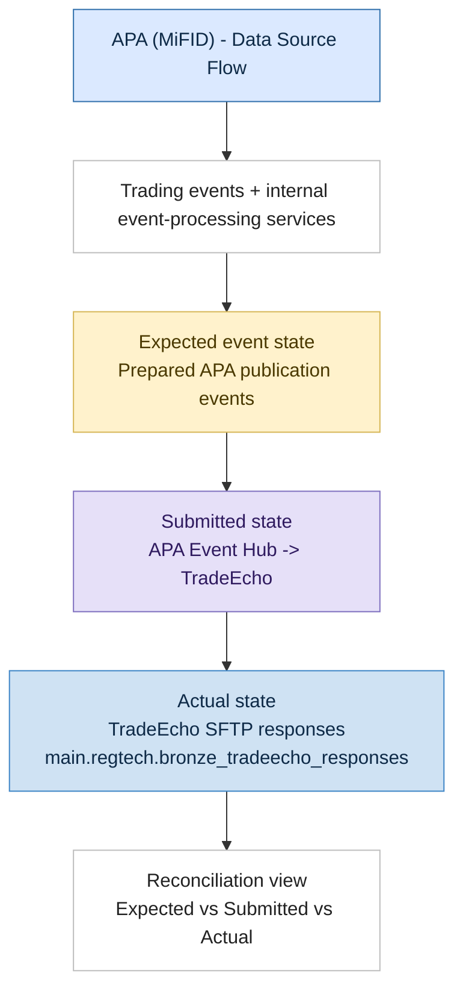

# APA Reporting Model - Data Source Flow

```mermaid
flowchart TB
  T["APA (MiFID) - Data Source Flow"]
  SRC["Trading events + internal event-processing services"]
  E["Expected event state<br/>Prepared APA publication events"]
  SUB["Submitted state<br/>APA Event Hub -> TradeEcho"]
  ACT["Actual state<br/>TradeEcho SFTP responses<br/>main.regtech.bronze_tradeecho_responses"]
  R["Reconciliation view<br/>Expected vs Submitted vs Actual"]

  T --> SRC
  SRC --> E --> SUB --> ACT --> R

  classDef title fill:#dbe9ff,stroke:#2f6fab,color:#0e2a47,fontStyle:bold,fontSize:14;
  classDef expected fill:#fff2cc,stroke:#d6b656,color:#4a3900;
  classDef submitted fill:#e6e0f8,stroke:#7f70bf,color:#2f1a5f;
  classDef actual fill:#cfe2f3,stroke:#3d85c6,color:#0e2a47;
  classDef neutral fill:#ffffff,stroke:#bdbdbd,color:#222;

  class T title;
  class E expected;
  class SUB submitted;
  class ACT actual;
  class SRC,R neutral;
```
