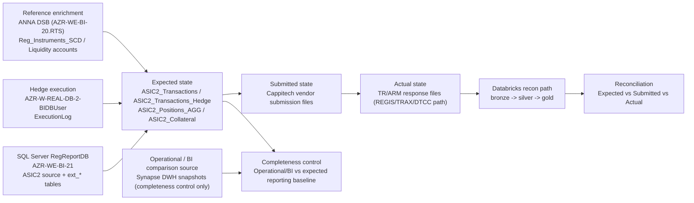

# ASIC Reporting Model - Data Source Flow

```mermaid
flowchart LR
  OBI["Operational / BI comparison source<br/>Synapse DWH snapshots (completeness control only)"]
  SRC2["SQL Server RegReportDB<br/>AZR-WE-BI-21<br/>ASIC2 source + ext_* tables"]
  SRC3["Hedge execution<br/>AZR-W-REAL-DB-2-BIDBUser<br/>ExecutionLog"]
  SRC4["Reference enrichment<br/>ANNA DSB (AZR-WE-BI-20.RTS)<br/>Reg_Instruments_SCD / Liquidity accounts"]

  EXP["Expected state<br/>ASIC2_Transactions / ASIC2_Transactions_Hedge<br/>ASIC2_Positions_AGG / ASIC2_Collateral"]
  SUB["Submitted state<br/>Cappitech vendor submission files"]
  ACT["Actual state<br/>TR/ARM response files (REGIS/TRAX/DTCC path)"]
  DBX["Databricks recon path<br/>bronze -> silver -> gold"]
  REC["Reconciliation<br/>Expected vs Submitted vs Actual"]
  CMP["Completeness control<br/>Operational/BI vs expected reporting baseline"]

  SRC2 --> EXP
  SRC3 --> EXP
  SRC4 --> EXP
  EXP --> SUB --> ACT --> DBX --> REC
  OBI --> CMP
  EXP --> CMP
```

