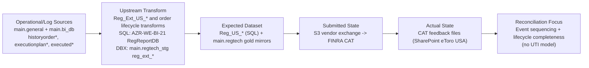

# CAT (US) Reporting Model - Data Source Flow

```mermaid
flowchart LR
  O["Operational/Log Sources<br/>main.general + main.bi_db<br/>historyorder*, executionplan*, executed*"]
  U["Upstream Transform<br/>Reg_Ext_US_* and order lifecycle transforms<br/>SQL: AZR-WE-BI-21 RegReportDB<br/>DBX: main.regtech_stg reg_ext_*"]
  E["Expected Dataset<br/>Reg_US_* (SQL) + main.regtech gold mirrors"]
  S["Submitted State<br/>S3 vendor exchange -> FINRA CAT"]
  A["Actual State<br/>CAT feedback files (SharePoint eToro USA)"]
  R["Reconciliation Focus<br/>Event sequencing + lifecycle completeness<br/>(no UTI model)"]

  O --> U --> E --> S --> A --> R
```

