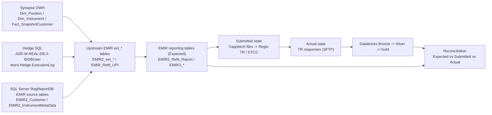

# EMIR (EU/UK) Data Source Flow

```mermaid
flowchart LR
  SRC1["Synapse DWH<br/>Dim_Position / Dim_Instrument / Fact_SnapshotCustomer"]
  SRC2["Hedge SQL<br/>AZR-W-REAL-DB-2-BIDBUser<br/>etoro.Hedge.ExecutionLog"]
  SRC3["SQL Server RegReportDB EMIR source tables<br/>EMIR2_Customer / EMIR2_InstrumentMetaData"]
  EXT1["Upstream EMIR ext_* tables<br/>EMIR2_ext_* / EMIR_Refit_UPI"]
  REP["EMIR reporting tables (Expected)<br/>EMIR2_Refit_Report / EMIR3_*"]
  SUB["Submitted state<br/>Cappitech files -> Regis-TR / DTCC"]
  ACT["Actual state<br/>TR responses (SFTP)"]
  DBX["Databricks Bronze -> Silver -> Gold"]
  REC["Reconciliation<br/>Expected vs Submitted vs Actual"]

  SRC1 --> EXT1
  SRC2 --> EXT1
  SRC3 --> EXT1
  EXT1 --> REP --> SUB --> ACT --> DBX --> REC
  REP --> REC
```

