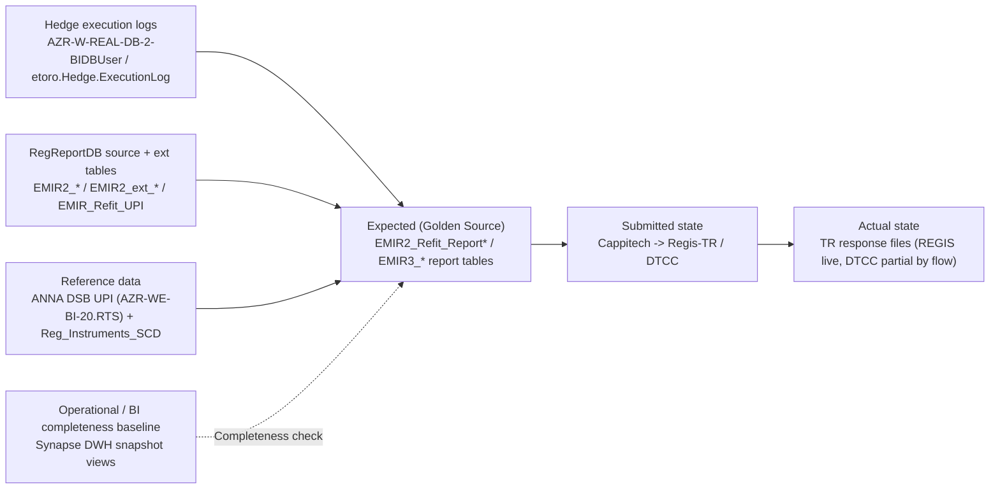

# EMIR (EU/UK) Reporting Model - Data Sources

```mermaid
flowchart LR
  B1["Operational / BI completeness baseline<br/>Synapse DWH snapshot views"]
  S1["Hedge execution logs<br/>AZR-W-REAL-DB-2-BIDBUser / etoro.Hedge.ExecutionLog"]
  S2["RegReportDB source + ext tables<br/>EMIR2_* / EMIR2_ext_* / EMIR_Refit_UPI"]
  S3["Reference data<br/>ANNA DSB UPI (AZR-WE-BI-20.RTS) + Reg_Instruments_SCD"]

  EXP["Expected (Golden Source)<br/>EMIR2_Refit_Report* / EMIR3_* report tables"]
  SUB["Submitted state<br/>Cappitech -> Regis-TR / DTCC"]
  ACT["Actual state<br/>TR response files (REGIS live, DTCC partial by flow)"]

  S1 --> EXP
  S2 --> EXP
  S3 --> EXP
  EXP --> SUB --> ACT
  B1 -. Completeness check .-> EXP
```

