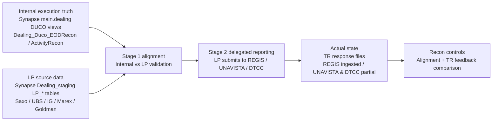

# LP Delegated Reporting - Data Source Flow

```mermaid
flowchart LR
  S1["Internal execution truth<br/>Synapse main.dealing DUCO views<br/>Dealing_Duco_EODRecon / ActivityRecon"]
  S2["LP source data<br/>Synapse Dealing_staging LP_* tables<br/>Saxo / UBS / IG / Marex / Goldman"]
  ST1["Stage 1 alignment<br/>Internal vs LP validation"]
  ST2["Stage 2 delegated reporting<br/>LP submits to REGIS / UNAVISTA / DTCC"]
  A["Actual state<br/>TR response files<br/>REGIS ingested / UNAVISTA & DTCC partial"]
  R["Recon controls<br/>Alignment + TR feedback comparison"]

  S1 --> ST1
  S2 --> ST1
  ST1 --> ST2 --> A --> R
```

