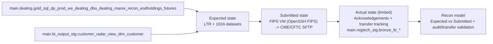

# LTR Data Sources and Flow

```mermaid
flowchart LR
  S1["main.dealing.gold_sql_dp_prod_we_dealing_dbo_dealing_marex_recon_eodholdings_futures"]
  S2["main.bi_output_stg.customer_radar_view_dim_customer"]
  E["Expected state<br/>LTR + 102A datasets"]
  U["Submitted state<br/>FIPS VM (OpenSSH FIPS) -> CME/CFTC SFTP"]
  A["Actual state (limited)<br/>Acknowledgements + transfer tracking<br/>main.regtech_stg.bronze_ltr_*"]
  R["Recon model<br/>Expected vs Submitted + audit/transfer validation"]

  S1 --> E
  S2 --> E
  E --> U --> A --> R
```

