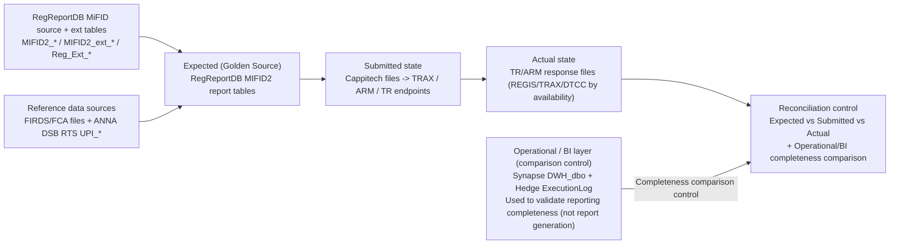

# MiFID (EU/UK) Reporting Model - Data Sources

```mermaid
flowchart LR
  OBI["Operational / BI layer (comparison control)<br/>Synapse DWH_dbo + Hedge ExecutionLog<br/>Used to validate reporting completeness (not report generation)"]
  SRC["RegReportDB MiFID source + ext tables<br/>MIFID2_* / MIFID2_ext_* / Reg_Ext_*"]
  REF["Reference data sources<br/>FIRDS/FCA files + ANNA DSB RTS UPI_*"]
  EXP["Expected (Golden Source)<br/>RegReportDB MIFID2 report tables"]
  SUB["Submitted state<br/>Cappitech files -> TRAX / ARM / TR endpoints"]
  ACT["Actual state<br/>TR/ARM response files (REGIS/TRAX/DTCC by availability)"]
  REC["Reconciliation control<br/>Expected vs Submitted vs Actual<br/>+ Operational/BI completeness comparison"]

  SRC --> EXP --> SUB --> ACT --> REC
  REF --> EXP
  OBI -->|Completeness comparison control| REC
```

