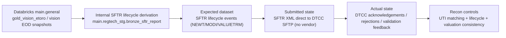

# Reporting Model: SFTR (Direct to DTCC) - Data Sources

```mermaid
flowchart LR
  S1["Databricks main.general\ngold_vision_etoro / vision EOD snapshots"]
  S2["Internal SFTR lifecycle derivation\nmain.regtech_stg.bronze_sftr_report"]
  EXP["Expected dataset\nSFTR lifecycle events (NEWT/MODI/VALU/ETRM)"]
  SUB["Submitted state\nSFTR XML direct to DTCC SFTP (no vendor)"]
  ACT["Actual state\nDTCC acknowledgements / rejections / validation feedback"]
  RECON["Recon controls\nUTI matching + lifecycle + valuation consistency"]

  S1 --> S2 --> EXP --> SUB --> ACT --> RECON
```

