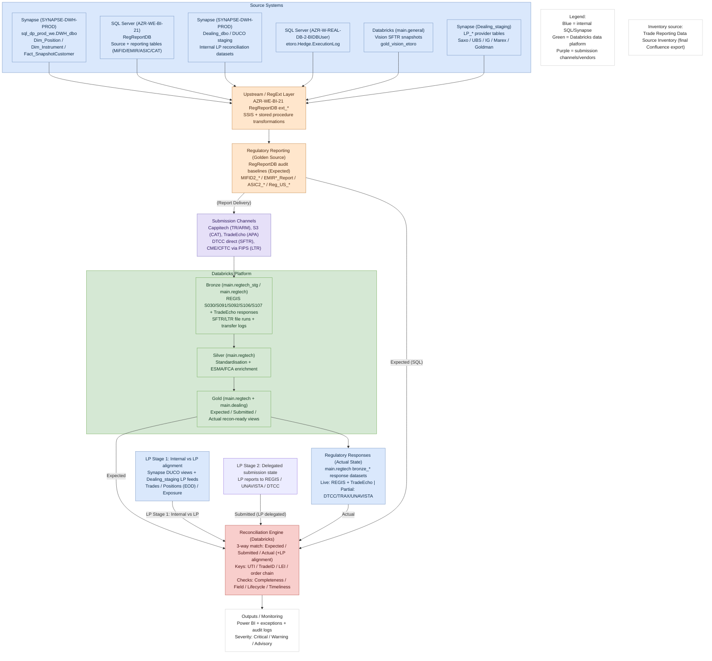

# Trade Recon Architecture V2 (Converted from draw.io XML)

```mermaid
flowchart TB
  %% Source systems
  subgraph SW1["Source Systems"]
    direction LR
    S1["Synapse (SYNAPSE-DWH-PROD)<br/>sql_dp_prod_we.DWH_dbo<br/>Dim_Position / Dim_Instrument / Fact_SnapshotCustomer"]
    S2["SQL Server (AZR-WE-BI-21)<br/>RegReportDB<br/>Source + reporting tables (MiFID/EMIR/ASIC/CAT)"]
    S3["Synapse (SYNAPSE-DWH-PROD)<br/>Dealing_dbo / DUCO staging<br/>Internal LP reconciliation datasets"]
    S4["SQL Server (AZR-W-REAL-DB-2-BIDBUser)<br/>etoro.Hedge.ExecutionLog"]
    S5["Databricks (main.general)<br/>Vision SFTR snapshots<br/>gold_vision_etoro"]
    S6["Synapse (Dealing_staging)<br/>LP_* provider tables<br/>Saxo / UBS / IG / Marex / Goldman"]
  end

  REGEXT["Upstream / RegExt Layer<br/>AZR-WE-BI-21 RegReportDB ext_*<br/>SSIS + stored procedure transformations"]
  REPORT["Regulatory Reporting (Golden Source)<br/>RegReportDB audit baselines (Expected)<br/>MIFID2_* / EMIR*_Report / ASIC2_* / Reg_US_*"]
  SUB["Submission Channels<br/>Cappitech (TR/ARM), S3 (CAT), TradeEcho (APA)<br/>DTCC direct (SFTR), CME/CFTC via FIPS (LTR)"]

  %% Databricks platform
  subgraph DB["Databricks Platform"]
    direction LR
    BRONZE["Bronze (main.regtech_stg / main.regtech)<br/>REGIS S030/S091/S092/S106/S107 + TradeEcho responses<br/>SFTR/LTR file runs + transfer logs"]
    SILVER["Silver (main.regtech)<br/>Standardisation + ESMA/FCA enrichment"]
    GOLD["Gold (main.regtech + main.dealing)<br/>Expected / Submitted / Actual recon-ready views"]
  end

  LP["LP Stage 1: Internal vs LP alignment<br/>Synapse DUCO views + Dealing_staging LP feeds<br/>Trades / Positions (EOD) / Exposure"]
  LPSUB["LP Stage 2: Delegated submission state<br/>LP reports to REGIS / UNAVISTA / DTCC"]
  TR["Regulatory Responses (Actual State)<br/>main.regtech bronze_* response datasets<br/>Live: REGIS + TradeEcho | Partial: DTCC/TRAX/UNAVISTA"]
  RECON["Reconciliation Engine (Databricks)<br/>3-way match: Expected / Submitted / Actual (+LP alignment)<br/>Keys: UTI / TradeID / LEI / order chain<br/>Checks: Completeness / Field / Lifecycle / Timeliness"]
  OUT["Outputs / Monitoring<br/>Power BI + exceptions + audit logs<br/>Severity: Critical / Warning / Advisory"]

  LEGEND["Legend:<br/>Blue = internal SQL/Synapse<br/>Green = Databricks data platform<br/>Purple = submission channels/vendors"]
  NOTE["Inventory source:<br/>Trade Reporting Data Source Inventory (final Confluence export)"]

  %% Edges translated from XML
  S1 --> REGEXT
  S2 --> REGEXT
  S3 --> REGEXT
  S4 --> REGEXT
  S5 --> REGEXT
  S6 --> REGEXT
  REGEXT --> REPORT
  REPORT -- "(Report Delivery)" --> SUB
  SUB --> BRONZE
  BRONZE --> SILVER --> GOLD
  GOLD -- "Expected" --> RECON
  LP -- "LP Stage 1: Internal vs LP" --> RECON
  LPSUB -- "Submitted (LP delegated)" --> RECON
  TR -- "Actual" --> RECON
  RECON --> OUT
  REPORT -- "Expected (SQL)" --> RECON
  GOLD --> TR

  classDef internal fill:#dae8fc,stroke:#6c8ebf,color:#0e2a47;
  classDef sql fill:#ffe6cc,stroke:#bf7f3f,color:#4a2a12;
  classDef vendor fill:#e6e0f8,stroke:#7f70bf,color:#2f1a5f;
  classDef dbx fill:#d5e8d4,stroke:#6aa84f,color:#12391f;
  classDef recon fill:#f8cecc,stroke:#b8544a,color:#4a1212;
  classDef neutral fill:#ffffff,stroke:#cccccc,color:#222;

  class SW1,S1,S2,S3,S4,S5,S6,LP,TR internal;
  class REGEXT,REPORT sql;
  class SUB vendor;
  class DB,BRONZE,SILVER,GOLD dbx;
  class RECON recon;
  class OUT,LEGEND,NOTE neutral;
```
