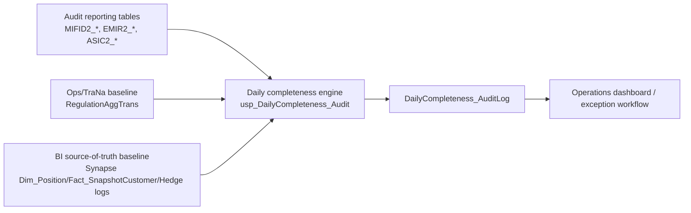

# Step 2C - Operational Completeness Reconciliation Control (Daily Audit)

Last updated: 2026-03-18  
Workstream: REG-3279 Step 2C (operational completeness)  
Owner: Reg Ops + Data Engineering

## 1) Purpose

This document defines the operational completeness control implemented by:

- `dbo.usp_DailyCompleteness_Audit`

The control answers:

- Are expected reporting records present in internal reporting tables?
- Do internal reporting counts reconcile to operational (TraNa/Ops) baselines?
- Do internal reporting counts reconcile to BI source-of-truth baselines?

This is the runtime counterpart to Step 2B (field lineage):

- Step 2B = design-time field mapping completeness.
- Step 2C = run-time record completeness control.

## 2) Relationship to Step 2A and Step 2B

| Step | Artifact purpose | Core question answered |
|---|---|---|
| Step 2A | Source inventory catalog | Which systems/tables/files exist? |
| Step 2B | Field-level mapping matrix | How is each field derived and reconciled? |
| Step 2C | Daily operational completeness control | Did all expected records appear across Audit vs TraNa vs BI? |

## 3) Scope covered by `usp_DailyCompleteness_Audit`

The procedure currently computes daily controls for:

1. MiFID UK CL  
2. MiFID EU CL  
3. MiFID EU Hedge  
4. MiFID EU AUS  
5. MiFID EU SC  
6. MiFID EU ME  
7. MiFID EU FCA  
8. EMIR TR CL  
9. EMIR TR AUS  
10. EMIR TR SC  
11. EMIR TR ME  
12. ASIC TR CL  
13. ASIC TR EU  
14. EMIR POS CL  
15. ASIC POS CL

## 4) Reconciliation model (three-way)

The control compares three independently derived baselines:

- **Audit baseline**: reporting-table population counts and cleaned mismatch sets.
- **TraNa/Ops baseline**: operational transaction aggregates (for eligible flows).
- **BI baseline**: independent DWH-derived population counts (Synapse/BI pipeline logic), subject to the current instrument-eligibility dependency noted below.



## 5) Key source tables used by the control

### 5.1 Audit-side reporting outputs

- `dbo.MIFID2_Report`
- `dbo.MIFID2_ETORO_Report`
- `dbo.MIFID2_ME_Report`
- `dbo.MIFID2_Hedge_Report`
- `dbo.EMIR2_Refit_Report`
- `dbo.EMIR2_ETORO_Refit_Trades`
- `dbo.EMIR3_ME_Refit_Report`
- `dbo.ASIC2_Transactions`
- `dbo.ASIC2_Positions_AGG`

### 5.2 Operational / TraNa counts

- `dbo.RegulationAggTrans`

### 5.3 BI source-of-truth components

- `[SYNAPSE-DWH-PROD].[sql_dp_prod_we].[DWH_dbo].[Dim_Position]`
- `[SYNAPSE-DWH-PROD].[sql_dp_prod_we].[DWH_dbo].[Dim_Instrument]`
- `[SYNAPSE-DWH-PROD].[sql_dp_prod_we].[DWH_dbo].[Fact_SnapshotCustomer]`
- `[SYNAPSE-DWH-PROD].[sql_dp_prod_we].[DWH_dbo].[Dim_Range]`
- `[AZR-W-REAL-DB-2-BIDBUser].[etoro].[Hedge].[ExecutionLog]`

Implementation note:

- BI helper temp tables used inside the procedure are documented separately in:
  - `Trade_Reporting_Reconciliation_Completeness_Control_Operational_Appendix.md` (Section 7)

### 5.4 Filter and exclusion controls

- `dbo.Reg_Instruments_SCD`
- `dbo.Reg_Regulation_Movments_Positions`
- `dbo.Reg_RegulationInOutDailyData`
- `[ThirdParty_Fivetran].[Fivetran].[regtech].[regulation_report_excluded_cids]`

### 5.5 Independence caveat (current state)

For MiFID/FCA eligibility filtering in Step 2C (`IsMifid`, `IsMifidByFCA`, and date-valid instrument joins), the control currently depends on:

- `dbo.Reg_Instruments_SCD`

This is a shared internal reference also used in reporting-table creation logic.  
Therefore, instrument eligibility validation is not yet fully independent from the reporting pipeline for these flags.

Planned enhancement path:

- Introduce independent external reference validation using:
  - ESMA FIRDS: `https://registers.esma.europa.eu/publication/searchRegister?core=esma_registers_firds#`
  - FCA reference data: `https://data.fca.org.uk/#/viewdata`

## 6) Core output metrics

For each `ReportDate` + `Regime`, the procedure persists:

- `Audit_Transaction_Count`
- `TraNa_Transaction_Count`
- `BI_Transaction_Count`
- `Audit_vs_TraNa_Mismatch`
- `Audit_vs_BI_Mismatch`
- `BI_vs_TraNa_Mismatch`
- `Clean_Missing_In_Audit`
- `Clean_Extra_In_Audit`
- `Clean_Mismatch_Total`
- `FalsePositives_Estimated`
- `Audit_vs_TraNa_Completeness`
- `Audit_vs_BI_Completeness`
- `Hedge_Mismatch_Is_FalsePositive_Flag`

### 6.1 Formula definitions

- `Audit_vs_TraNa_Mismatch = Audit_Transaction_Count - TraNa_Transaction_Count`
- `Audit_vs_BI_Mismatch = Audit_Transaction_Count - BI_Transaction_Count`
- `BI_vs_TraNa_Mismatch = BI_Transaction_Count - TraNa_Transaction_Count` (null where TraNa not applicable)
- `Audit_vs_TraNa_Completeness = (TraNa_Transaction_Count - Clean_Missing_In_Audit) / TraNa_Transaction_Count`
- `Audit_vs_BI_Completeness = Audit_Transaction_Count / BI_Transaction_Count`

Note:

- MiFID EU Hedge has explicit false-positive logic in the procedure: when BI and Audit match, hedge mismatch can be marked as non-defect (`Hedge_Mismatch_Is_FalsePositive_Flag=1`).

## 7) Data quality normalization and false-positive reduction

Before final metrics are calculated, intermediate mismatch datasets are cleaned by:

- migration-window exclusions (`OpenOccurred`, `ExecutionTime`, `Migration_Occurred` checks),
- regulation movement exclusions (PrevRegulationID / RegulationID transitions),
- synthetic/open-close suppression in affected flows,
- known-customer exclusion filters from Fivetran reference.

This allows:

- raw mismatch (signal),
- cleaned mismatch (actionable signal),
- false-positive estimate (noise control).

## 8) Procedure runbook

### 8.1 Standard daily run

```sql
EXEC dbo.usp_DailyCompleteness_Audit
    @AsOfDate = NULL,
    @ReturnResults = 0;
```

### 8.2 Backfill or ad-hoc run

```sql
EXEC dbo.usp_DailyCompleteness_Audit
    @AsOfDate = '2026-03-18',
    @ReturnResults = 1;
```

### 8.3 Output table

Run results are persisted to:

- `dbo.DailyCompleteness_AuditLog`

Recommended operational query pattern:

```sql
SELECT TOP (500)
       RunDtmUtc,
       ReportDate,
       Regime,
       Audit_Transaction_Count,
       TraNa_Transaction_Count,
       BI_Transaction_Count,
       Audit_vs_TraNa_Completeness,
       Audit_vs_BI_Completeness,
       Clean_Mismatch_Total
FROM dbo.DailyCompleteness_AuditLog
ORDER BY RunDtmUtc DESC, ReportDate DESC, OrderID;
```

## 9) Management presentation format

For manager updates, present Step 2C as:

1. **Coverage**: regimes included (15)
2. **Latest run health**: count of green/amber/red regimes
3. **Top exceptions**: highest `Clean_Mismatch_Total` and lowest completeness
4. **Action owners**: named owner and target action per exception
5. **Trend**: 5-day trend of `Audit_vs_BI_Completeness`

## 10) Governance and threshold placeholders (for sign-off)

Until formal calibration is approved, use temporary triage bands:

- **Green**: completeness >= 99.5%
- **Amber**: 98.0% to <99.5%
- **Red**: <98.0%

These thresholds must be finalized in the Step 2 validation/sign-off workshop and can be regime-specific once approved.

## 11) Known caveats and interpretation notes

- Position regimes (`EMIR POS CL`, `ASIC POS CL`) intentionally have no TraNa comparison in the current logic.
- Monday logic shifts report window to cover weekend behavior (`@ReportDate1` case logic).
- Completeness is sensitive to upstream filters (`IsMifid`, `IsMifidByFCA`, settled-state, account and country exclusions).
- BI baseline is independent by design; mismatches can indicate either reporting gaps or baseline/filter drift and must be triaged.

## 12) Link back to Step 2B

Step 2C identifies **which records/regimes are incomplete**.  
Step 2B explains **which fields and derivations caused the issue**.

Operational workflow:

1. Detect issue in Step 2C output (`DailyCompleteness_AuditLog`),
2. Isolate regime/date/key mismatch,
3. Use Step 2B mapping rows and Step 2A lineage appendix to trace root cause,
4. Document resolution and control tuning.

## 13) Detailed appendix

For regulation-by-regulation implementation detail (tables, joins, and filters used per flow), see:

- `Trade_Reporting_Reconciliation_Completeness_Control_Operational_Appendix.md`
