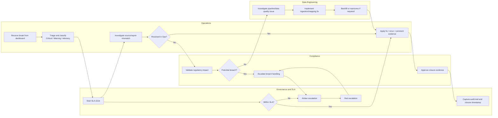

# Exception Lifecycle Swimlane (Break Handling and Escalation)

```mermaid
flowchart LR
  %% Swimlane-like groups implemented with subgraphs
  subgraph Ops["Operations"]
    O1["Receive break from dashboard"]
    O2["Triage and classify<br/>Critical / Warning / Advisory"]
    O3["Investigate source/report mismatch"]
    O4{"Resolved in Ops?"}
    O5["Apply fix / rerun / comment evidence"]
  end

  subgraph Compliance["Compliance"]
    C1["Validate regulatory impact"]
    C2{"Potential breach?"}
    C3["Approve closure evidence"]
    C4["Escalate breach handling"]
  end

  subgraph DataEng["Data Engineering"]
    D1["Investigate pipeline/data quality issue"]
    D2["Implement ingestion/mapping fix"]
    D3["Backfill or reprocess if required"]
  end

  subgraph Governance["Governance and SLA"]
    G1["Start SLA clock"]
    G2{"Within SLA?"}
    G3["Amber escalation"]
    G4["Red escalation"]
    G5["Capture audit trail and closure timestamp"]
  end

  O1 --> O2 --> G1 --> O3 --> O4
  O4 -->|Yes| O5 --> C3 --> G5
  O4 -->|No| C1 --> C2
  C2 -->|No| D1
  C2 -->|Yes| C4 --> G3
  D1 --> D2 --> D3 --> O5
  G1 --> G2
  G2 -->|Yes| O5
  G2 -->|No| G3 --> G4 --> C4
```

