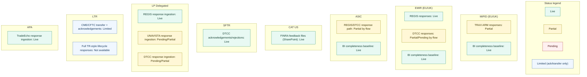

## Ingestion Coverage Status by Endpoint and Model

```mermaid
flowchart TB
  subgraph LEGEND["Status legend"]
    L1["Live"]
    L2["Partial"]
    L3["Pending"]
    L4["Limited (ack/transfer only)"]
  end

  subgraph MIFID["MiFID (EU/UK)"]
    M1["TRAX ARM responses: Partial"]
    M2["BI completeness baseline: Live"]
  end

  subgraph EMIR["EMIR (EU/UK)"]
    E1["REGIS responses: Live"]
    E2["DTCC responses: Partial/Pending by flow"]
    E3["BI completeness baseline: Live"]
  end

  subgraph ASIC["ASIC"]
    A1["REGIS/DTCC response path: Partial by flow"]
    A2["BI completeness baseline: Live"]
  end

  subgraph CAT["CAT US"]
    C1["FINRA feedback files (SharePoint): Live"]
  end

  subgraph SFTR["SFTR"]
    S1["DTCC acknowledgements/rejections: Live"]
  end

  subgraph LP["LP Delegated"]
    P1["REGIS response ingestion: Live"]
    P2["UNAVISTA response ingestion: Pending/Partial"]
    P3["DTCC response ingestion: Pending/Partial"]
  end

  subgraph LTR["LTR"]
    R1["CME/CFTC transfer + acknowledgements: Limited"]
    R2["Full TR-style lifecycle responses: Not available"]
  end

  subgraph APA["APA"]
    AP1["TradeEcho response ingestion: Live"]
  end

  classDef live fill:#e8f9f3,stroke:#1d8a66,color:#0f3c2e;
  classDef partial fill:#fff7d6,stroke:#9b8700,color:#3d3400;
  classDef pending fill:#fff0f0,stroke:#a33,color:#4a1212;
  classDef limited fill:#f0f7ff,stroke:#3f6ca8,color:#123457;

  class L1,M2,E1,E3,A2,C1,S1,P1,AP1 live;
  class L2,M1,E2,A1,P2,P3 partial;
  class L3 pending;
  class L4,R1,R2 limited;
```

