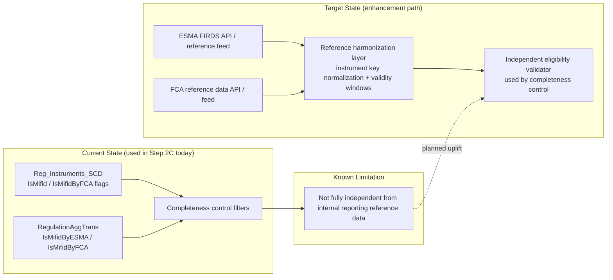

# Instrument Eligibility Validation - Current vs Target State

```mermaid
flowchart LR
  subgraph CUR["Current State (used in Step 2C today)"]
    C1["Reg_Instruments_SCD<br/>IsMifid / IsMifidByFCA flags"]
    C2["RegulationAggTrans<br/>IsMifidByESMA / IsMifidByFCA"]
    C3["Completeness control filters"]
    C1 --> C3
    C2 --> C3
  end

  subgraph GAP["Known Limitation"]
    G1["Not fully independent from internal reporting reference data"]
  end

  subgraph TAR["Target State (enhancement path)"]
    T1["ESMA FIRDS API / reference feed"]
    T2["FCA reference data API / feed"]
    T3["Reference harmonization layer<br/>instrument key normalization + validity windows"]
    T4["Independent eligibility validator<br/>used by completeness control"]
    T1 --> T3
    T2 --> T3
    T3 --> T4
  end

  C3 --> G1
  G1 -. planned uplift .-> T4
```

