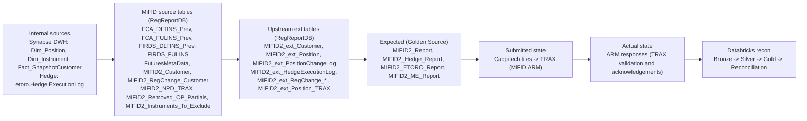
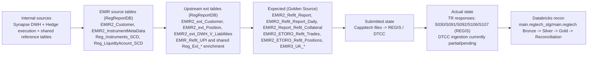
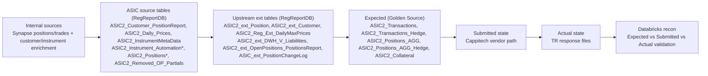
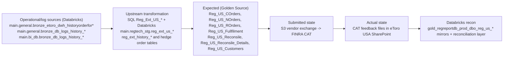
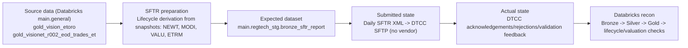
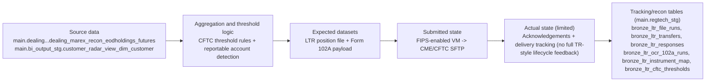
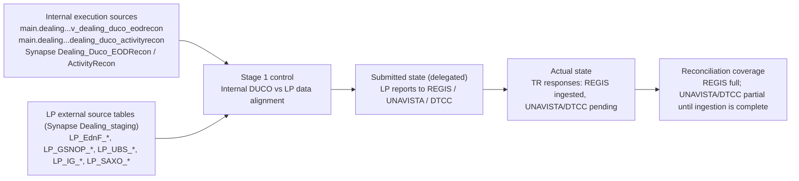
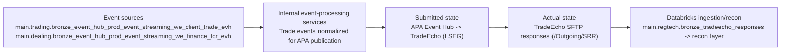

# Reporting Model Data Source Flows

This page provides separate flow diagrams for each reporting model, with MiFID, EMIR, and ASIC split individually.

## MiFID (EU/UK) - ARM-Based

## EMIR (EU/UK) - TR-Based

## ASIC - TR-Based

## CAT (US) - Event-Driven

## SFTR - Direct to DTCC

## LTR - Manual / Transitional

## LP Delegated Reporting

## APA (MiFID) - Real-Time Publication

