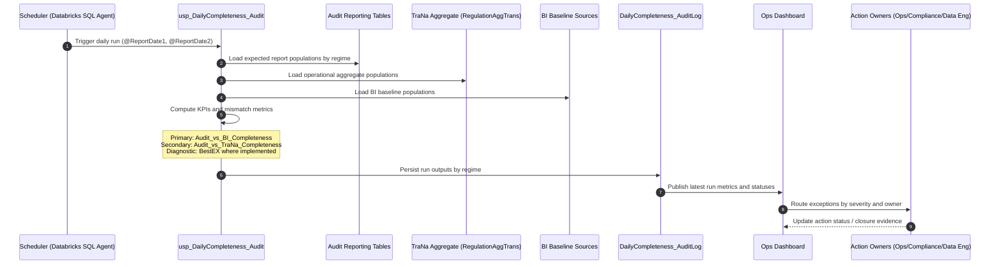

# Step 2C Daily Operational Sequence (BI-Prioritized Completeness)

```mermaid
sequenceDiagram
  autonumber
  participant S as Scheduler (Databricks SQL Agent)
  participant P as usp_DailyCompleteness_Audit
  participant A as Audit Reporting Tables
  participant T as TraNa Aggregate (RegulationAggTrans)
  participant B as BI Baseline Sources
  participant L as DailyCompleteness_AuditLog
  participant D as Ops Dashboard
  participant O as Action Owners (Ops/Compliance/Data Eng)

  S->>P: Trigger daily run (@ReportDate1, @ReportDate2)
  P->>A: Load expected report populations by regime
  P->>T: Load operational aggregate populations
  P->>B: Load BI baseline populations
  P->>P: Compute KPIs and mismatch metrics
  Note over P: Primary: Audit_vs_BI_Completeness<br/>Secondary: Audit_vs_TraNa_Completeness<br/>Diagnostic: BestEX where implemented
  P->>L: Persist run outputs by regime
  L->>D: Publish latest run metrics and statuses
  D->>O: Route exceptions by severity and owner
  O-->>D: Update action status / closure evidence
```

